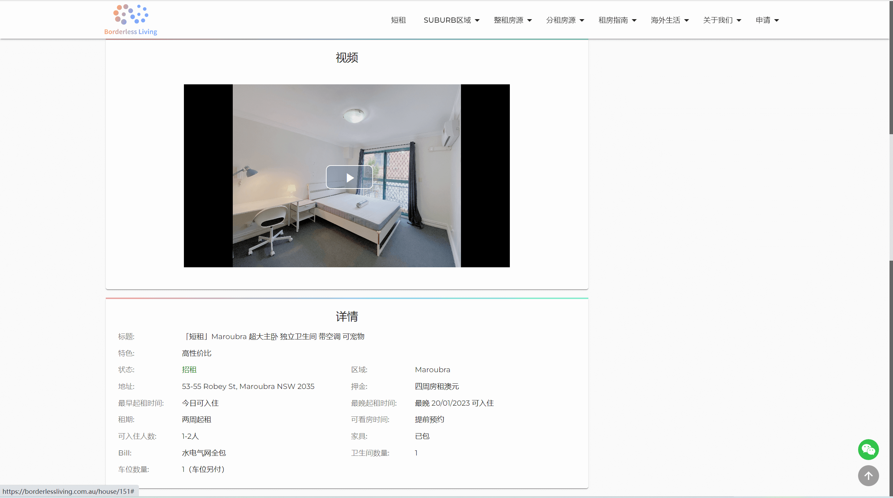
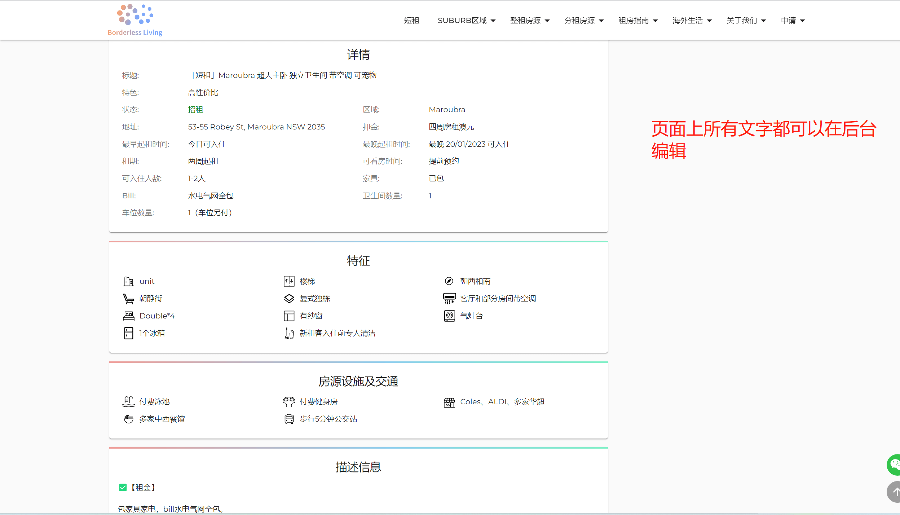
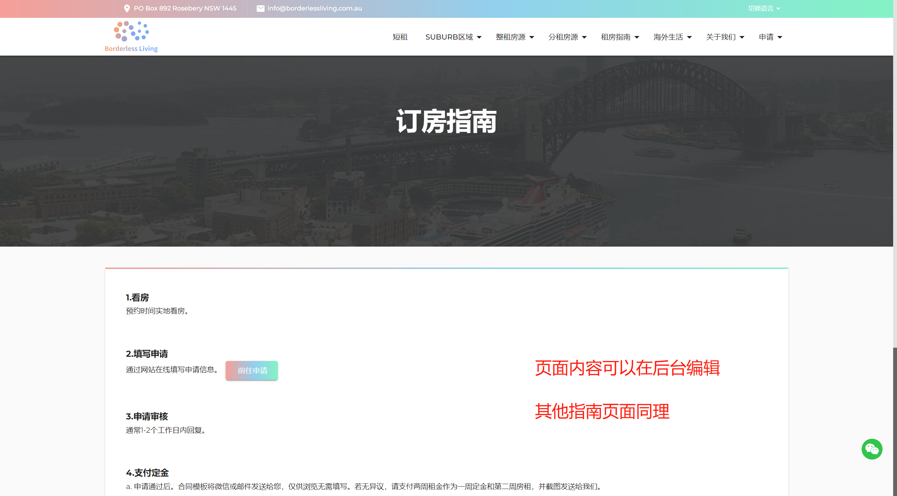
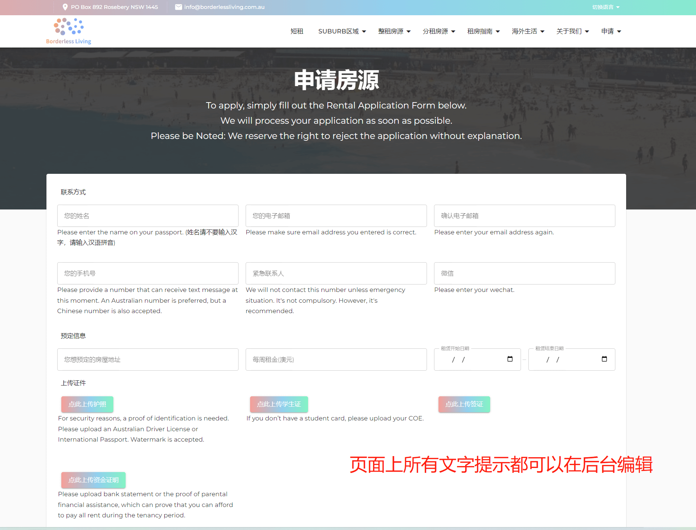
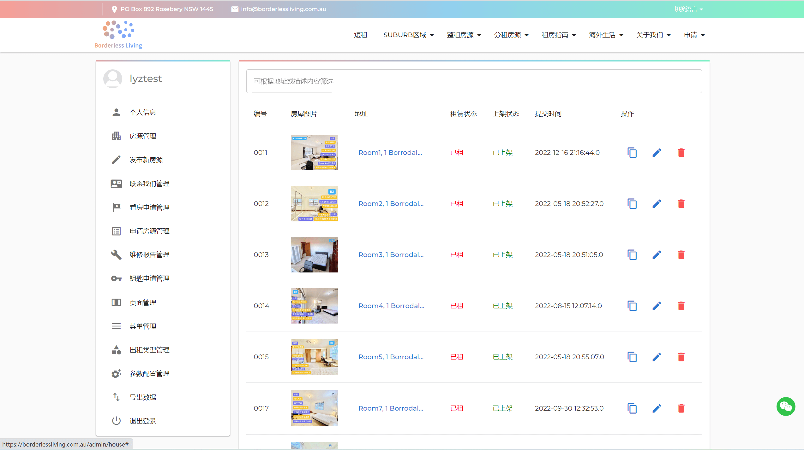
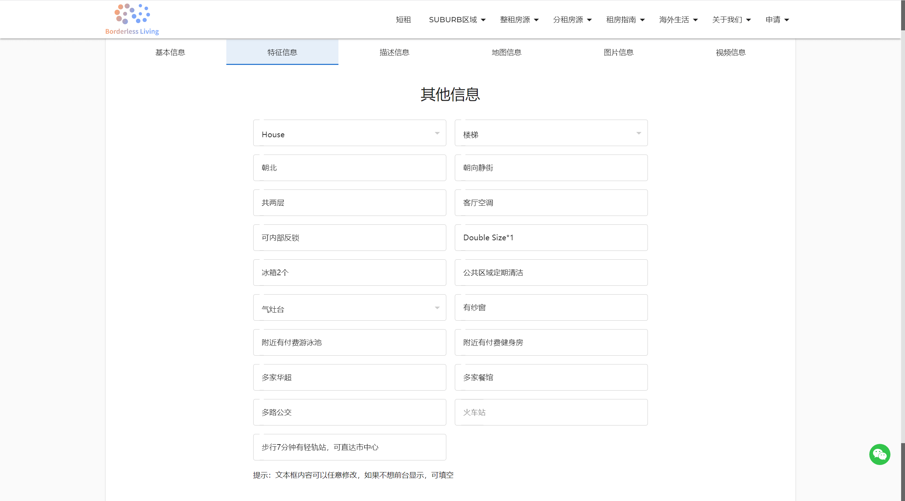
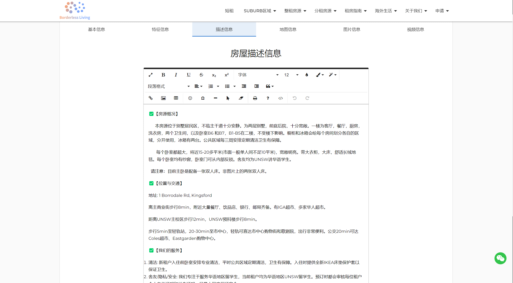
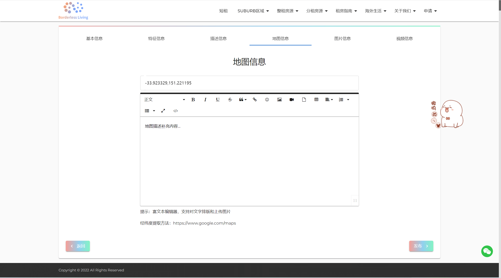
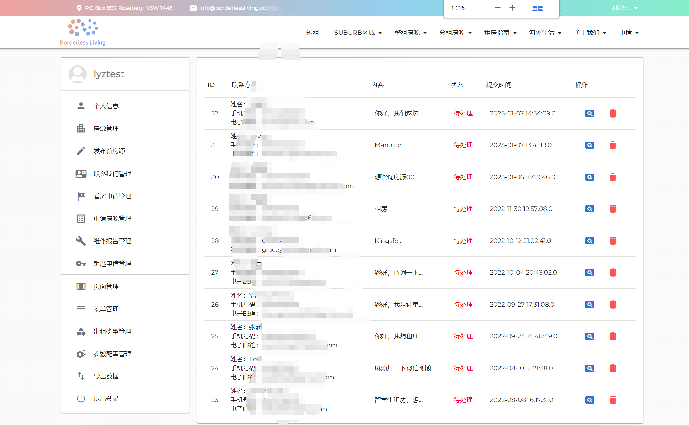
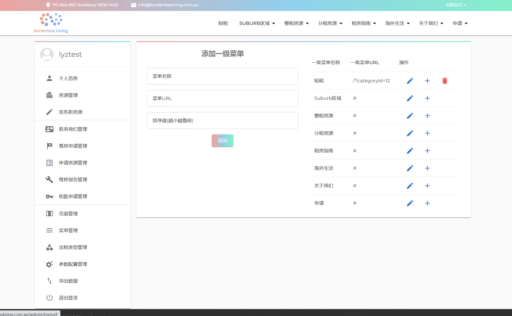

- 基于SpringBoot的房屋租赁平台 房屋展示平台 留学生房屋租赁平台
- 在线预览地址：[https://borderlessliving.com.au/](https://borderlessliving.com.au) 
- 介绍视频地址1(百度网盘，推荐)：[https://pan.baidu.com/s/1KHasGrYjU3nkcUFMWMXwaQ?pwd=4sx7](https://pan.baidu.com/s/1KHasGrYjU3nkcUFMWMXwaQ?pwd=4sx7) 
- 介绍视频地址2(其他，慢点)：[https://static.borderlessliving.com.au/upload/2023/1/1f9537aae59547edb44d929efd84de1a.mp4](https://static.borderlessliving.com.au/upload/2023/1/1f9537aae59547edb44d929efd84de1a.mp4)
- 详细介绍地址(更新在此)：[https://liuyanzhao.com/shop/housekey.html](https://liuyanzhao.com/shop/housekey.html)
- 最新更新时间：2023年1月9日

# 一、功能介绍
- 该项目是给澳洲房产中介做的一个系统，用于展示房源信息的，同时提供指导和一些申请功能。
- 修改历史见文档，功能细节优化很多，做的很细腻，具体可以看下面图
- 房屋浏览、搜索、根据类型小区筛选、房源图片、房源视频、房源地图等等
- 我们的团队、我们的服务、联系我们
- 看房申请、申请房源、维修报告、钥匙申请、联系我们
- 订房指南、入住指南、退房指南 (页面内容可以后天编辑)
- 后台管理、房源信息发布、各种申请管理、联系我们管理
- 参数管理 (系统参数配置，以及页面上所有内容文字可以在后台配置)
- 出租类型管理、菜单管理、页面管理
- 导出功能，导出房源信息，申请信息
- 总之，功能很多，做的很细腻，经过多人长时间测试

# 二、技术组成
- 1、SpringBoot
- 2、Thymeleaf
- 3、Bootstrap
- 4、MySQL

# 三、项目截图
1-首页1.png

2-首页2.png

3-房屋详情1.png

4-房屋详情2.png

5-房屋详情3.png

6-房屋详情4.png

7-定房指南.png

8-申请房源页面.png

9-看房申请页面.png

10-后台房源管理.png

11-后台房源发布编辑1.png

12-后台房源发布编辑2.png

13-后台房源发布编辑3.png

14-后台房源发布编辑4.png

15-后台房源发布编辑5.png

16-后台房源发布编辑6.png

17-联系我们管理.png

18-自定义页面管理.png

19-菜单管理.png

20-出租类型管理.png

21-参数配置.png

# 四、联系方式
需要完整代码联系博主，微信847064370

